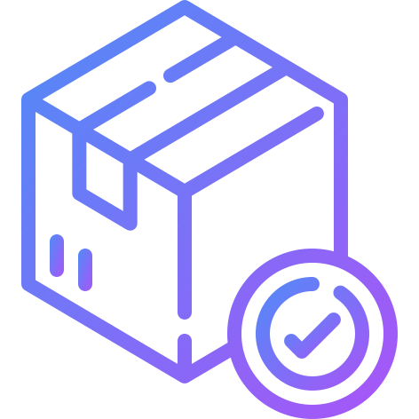

#  CRM-бот для бизнеса

Telegram-бот для управления клиентами, заказами, статусами, аналитикой, с ИИ-помощником и графиками.

[](#)
[](#)
[](#)
[](#)
[](#)

##  Живой пример

[Перейти к боту](https://t.me/XvolkX_crm_bot)

##  Функции

-  Управление клиентами — добавление, список, карточка клиента
-  Управление заказами — создание, статусы, пагинация, фильтрация
-  Аналитика и отчёты — статистика, прогнозы, топ клиентов
-  ИИ-помощник — отвечает на вопросы, даёт рекомендации
-  Роли и права — админ, менеджер, клиент
-  Авто-отчёты — ежедневные отчёты админу
-  Безопасность — только админы видят все заказы
-  Нижнее меню — удобное управление через кнопки

##  Как запустить локально

1. Клонируй репозиторий:
   ```bash
   git clone https://github.com/xVOLKx/parser-analytics-bot.git
   cd crm-bot
   ```
2. Установи зависимости:
    ```bash
    npm install
    ```
3. Создай файл .env и добавь:
    ```bash
    DB_USER=postgres
    DB_PASSWORD=твой_пароль
    DB_HOST=localhost
    DB_PORT=5432
    DB_NAME=crm_bot
    BOT_TOKEN=твой_токен
    YANDEX_API_KEY=твой_ключ
    YANDEX_FOLDER_ID=твой_folder_id

    ```
4. Запусти:
    ```bash
    node index.js
    ```
##  Технологии 

-  Node.js + Telegraf
-  PostgreSQL + Sequelize
-  Yandex GPT
-  Chart.js (графики)
-  Axios (API-запросы)

##  GitHub
[Перейти в репозиторий](https://github.com/xVOLKx/crm-bot)

##  Лицензия

MIT © [xVOLKx](https://github.com/xVOLKx)
